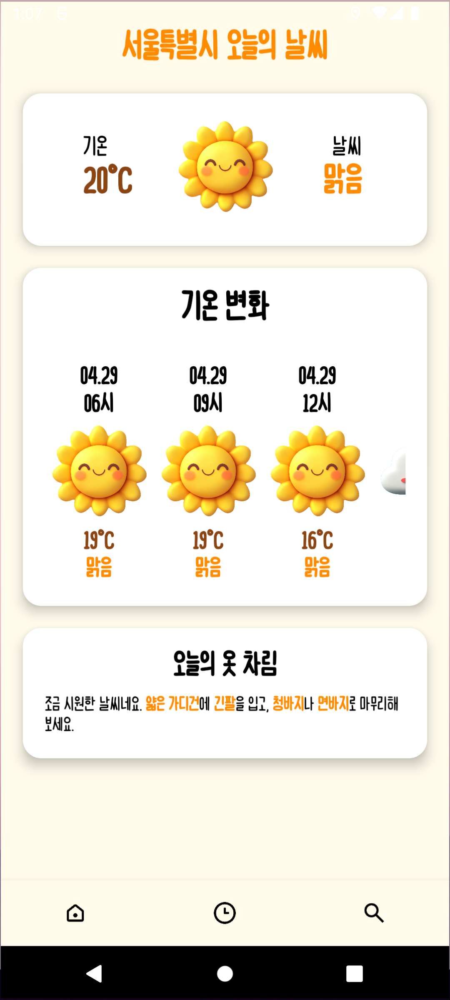
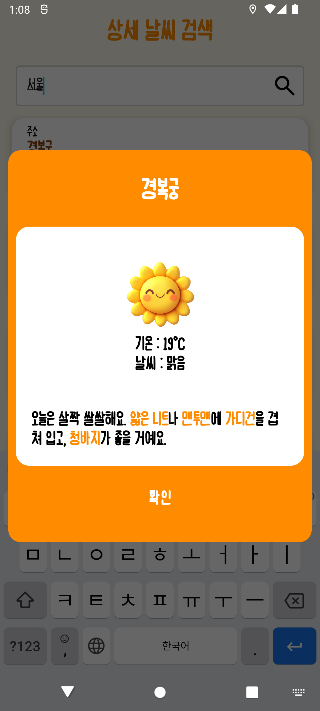
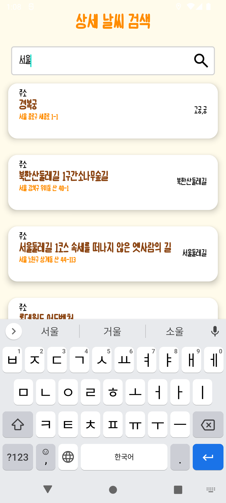
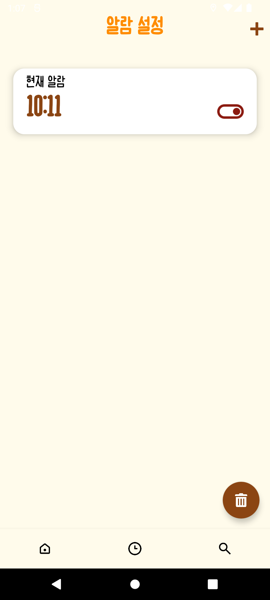
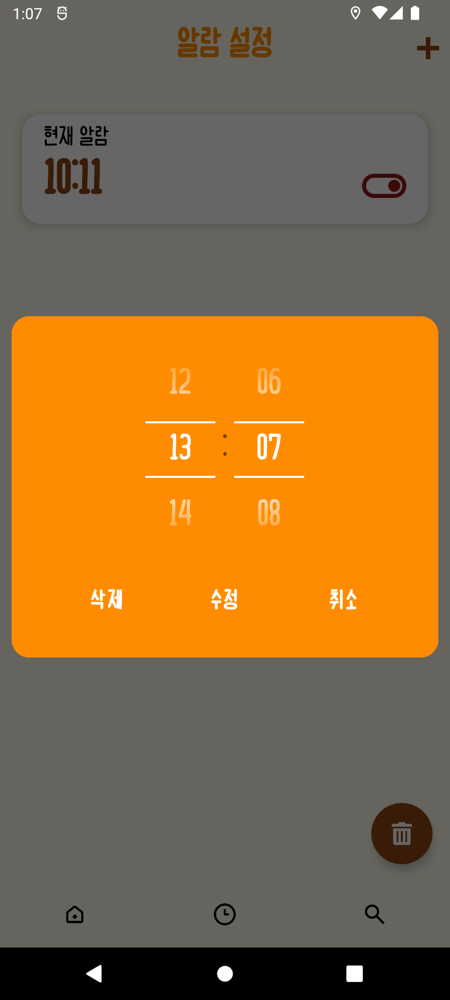

# 온도옷도 (OndoOtdo)

<p align="center">
  <strong>날씨에 맞는 완벽한 옷차림을 추천해드립니다</strong>
</p>

<p align="center">
  <a href="https://github.com/pyowonsik/OndoOtdo">
    
  </a>
  
  
</p>

## 목차

- [개요](#개요)
- [스크린샷](#스크린샷)
- [기술 스택](#기술-스택)
- [주요 기능 & 구현 내용](#주요-기능--구현-내용)
- [리뷰](#리뷰)
- [아키텍처](#아키텍처)
- [느낀 점](#느낀-점)

## 개요

**온도옷도**는 일교차가 큰 날씨에 적합한 옷차림을 추천하여, 사용자가 매일 아침 옷을 고를 때 겪는 고민을 덜어주는 날씨 기반 패션 추천 애플리케이션입니다.

### 프로젝트 정보

- **개발 기간**: 2024.09 ~ 2024.11 (3개월)
- **플랫폼**: Android
- **언어**: Kotlin
- **아키텍처**: MVVM (Model-View-ViewModel)

### 핵심 기능

✅ **실시간 날씨 기반 옷차림 추천**  
✅ **출근/등교 알람 기능** (날씨 정보 + 준비물 안내)  
✅ **상세 주소 검색** (방문 예정지 날씨 확인)  
✅ **일교차 정보 제공** (최저/최고 기온)  
✅ **필요한 준비물 알림** (우산, 외투 등)

## 스크린샷

<p align="center">
  
  
  
  
  
  
  
</p>

## 기술 스택

### Language & Framework

 

### Architecture & Components

   

### Network & Data

  

### Libraries


## 주요 기능 & 구현 내용

### 🏛️ MVVM 아키텍처 기반 앱 개발

**목표**: UI 로직과 비즈니스 로직을 명확히 분리하여 유지보수성과 테스트 효율 향상

**구현 내용**:

```kotlin
// ViewModel: 비즈니스 로직 관리
class WeatherViewModel(private val repository: WeatherRepository) : ViewModel() {
    private val _weatherData = MutableLiveData<WeatherData>()
    val weatherData: LiveData<WeatherData> = _weatherData

    fun fetchWeather(location: String) = viewModelScope.launch {
        _weatherData.value = repository.getWeather(location)
    }
}

// View: UI만 담당 (DataBinding 활용)
binding.viewModel = weatherViewModel
binding.lifecycleOwner = this
```

**적용 기술**:

- **ViewModel**: 화면 회전 시에도 데이터 유지
- **LiveData**: 데이터 변경 시 UI 자동 업데이트
- **DataBinding**: XML에서 직접 ViewModel 데이터 참조

**효과**:

- UI와 로직 분리로 코드 가독성 향상
- 테스트 용이성 증가
- 생명주기 자동 관리

### 🌐 네트워크 통신 구현 (Retrofit)

**목표**: 외부 날씨 API와 안정적인 통신

**API 구조**:

```kotlin
interface WeatherApiService {
    @GET("weather")
    suspend fun getCurrentWeather(
        @Query("q") location: String,
        @Query("appid") apiKey: String
    ): Response<WeatherResponse>
}

// Retrofit 인스턴스 생성
object RetrofitClient {
    private const val BASE_URL = "https://api.openweathermap.org/data/2.5/"

    val apiService: WeatherApiService by lazy {
        Retrofit.Builder()
            .baseUrl(BASE_URL)
            .addConverterFactory(GsonConverterFactory.create())
            .build()
            .create(WeatherApiService::class.java)
    }
}
```

**Coroutine 비동기 처리**:

```kotlin
viewModelScope.launch {
    try {
        val response = repository.getWeather(location)
        if (response.isSuccessful) {
            _weatherData.value = response.body()
        }
    } catch (e: Exception) {
        _error.value = "네트워크 오류: ${e.message}"
    }
}
```

**특징**:

- `suspend` 함수로 비동기 처리
- 메인 스레드 블로킹 방지
- 에러 핸들링으로 안정성 확보

### 🖼️ 이미지 로딩 최적화 (Glide)

**목표**: 날씨 아이콘 및 배경 이미지 효율적 로딩

**구현**:

```kotlin
// DataBinding + Glide
@BindingAdapter("imageUrl")
fun loadImage(view: ImageView, url: String?) {
    Glide.with(view.context)
        .load(url)
        .placeholder(R.drawable.loading)
        .error(R.drawable.error)
        .diskCacheStrategy(DiskCacheStrategy.ALL)
        .into(view)
}

// XML에서 사용
<ImageView
    android:layout_width="100dp"
    android:layout_height="100dp"
    app:imageUrl="@{viewModel.weatherIcon}" />
```

**최적화 전략**:

- **메모리 캐싱**: 동일 이미지 재사용
- **디스크 캐싱**: 네트워크 사용 최소화
- **Placeholder**: 로딩 중 UX 개선
- **에러 이미지**: 실패 시 대체 이미지

### 💾 로컬 데이터 관리 (Room)

**목표**: 사용자 설정 및 알람 데이터 영구 저장

**Entity 정의**:

```kotlin
@Entity(tableName = "alarm_settings")
data class AlarmSetting(
    @PrimaryKey(autoGenerate = true)
    val id: Int = 0,

    @ColumnInfo(name = "alarm_time")
    val alarmTime: String,

    @ColumnInfo(name = "is_enabled")
    val isEnabled: Boolean,

    @ColumnInfo(name = "location")
    val location: String
)
```

**DAO (Data Access Object)**:

```kotlin
@Dao
interface AlarmDao {
    @Query("SELECT * FROM alarm_settings WHERE is_enabled = 1")
    fun getEnabledAlarms(): Flow<List<AlarmSetting>>

    @Insert(onConflict = OnConflictStrategy.REPLACE)
    suspend fun insertAlarm(alarm: AlarmSetting)

    @Update
    suspend fun updateAlarm(alarm: AlarmSetting)

    @Delete
    suspend fun deleteAlarm(alarm: AlarmSetting)
}
```

**Database**:

```kotlin
@Database(entities = [AlarmSetting::class], version = 1)
abstract class AppDatabase : RoomDatabase() {
    abstract fun alarmDao(): AlarmDao
}
```

**Flow를 통한 실시간 데이터 감지**:

```kotlin
// ViewModel
val alarms: LiveData<List<AlarmSetting>> =
    alarmDao.getEnabledAlarms().asLiveData()
```

### ⏰ 알람 기능 구현

**목표**: 설정 시간에 날씨 정보와 옷차림 추천 알림 제공

**AlarmManager 설정**:

```kotlin
fun setAlarm(context: Context, alarmTime: Long, alarmId: Int) {
    val alarmManager = context.getSystemService(Context.ALARM_SERVICE) as AlarmManager

    val intent = Intent(context, NotificationReceiver::class.java).apply {
        putExtra("ALARM_ID", alarmId)
    }

    val pendingIntent = PendingIntent.getBroadcast(
        context,
        alarmId,
        intent,
        PendingIntent.FLAG_UPDATE_CURRENT or PendingIntent.FLAG_IMMUTABLE
    )

    // 정확한 시간에 알람 실행
    alarmManager.setExactAndAllowWhileIdle(
        AlarmManager.RTC_WAKEUP,
        alarmTime,
        pendingIntent
    )
}
```

**BroadcastReceiver**:

```kotlin
class NotificationReceiver : BroadcastReceiver() {
    override fun onReceive(context: Context, intent: Intent) {
        val alarmId = intent.getIntExtra("ALARM_ID", 0)

        // 날씨 정보 가져오기
        CoroutineScope(Dispatchers.IO).launch {
            val weather = getWeatherData()
            showNotification(context, weather)
        }
    }

    private fun showNotification(context: Context, weather: WeatherData) {
        val notification = NotificationCompat.Builder(context, CHANNEL_ID)
            .setSmallIcon(R.drawable.ic_weather)
            .setContentTitle("오늘의 날씨: ${weather.temperature}°C")
            .setContentText(getClothingRecommendation(weather))
            .setStyle(NotificationCompat.BigTextStyle()
                .bigText("${weather.description}\n필요한 준비물: ${weather.items}"))
            .setPriority(NotificationCompat.PRIORITY_HIGH)
            .build()

        NotificationManagerCompat.from(context).notify(alarmId, notification)
    }
}
```

**Notification Channel (Android 8.0+)**:

```kotlin
private fun createNotificationChannel(context: Context) {
    if (Build.VERSION.SDK_INT >= Build.VERSION_CODES.O) {
        val channel = NotificationChannel(
            CHANNEL_ID,
            "날씨 알림",
            NotificationManager.IMPORTANCE_HIGH
        ).apply {
            description = "날씨와 옷차림 정보 알림"
        }

        val notificationManager = context.getSystemService(NotificationManager::class.java)
        notificationManager.createNotificationChannel(channel)
    }
}
```

**특징**:

- `setExactAndAllowWhileIdle`: 절전 모드에서도 정확한 시간에 실행
- 백그라운드에서 날씨 API 호출
- Rich Notification으로 상세 정보 제공

### ⚡ 비동기 작업 최적화 (Coroutine)

**목표**: 모든 I/O 작업을 비동기 처리하여 메인 스레드 보호

**Dispatchers 활용**:

```kotlin
class WeatherRepository(
    private val apiService: WeatherApiService,
    private val alarmDao: AlarmDao
) {
    // 네트워크 작업: IO Dispatcher
    suspend fun getWeather(location: String): WeatherData =
        withContext(Dispatchers.IO) {
            apiService.getCurrentWeather(location).body()!!
        }

    // 데이터베이스 작업: IO Dispatcher
    suspend fun saveAlarm(alarm: AlarmSetting) =
        withContext(Dispatchers.IO) {
            alarmDao.insertAlarm(alarm)
        }

    // UI 업데이트: Main Dispatcher (자동)
    fun updateUI(data: WeatherData) = viewModelScope.launch {
        _weatherLiveData.value = data
    }
}
```

**에러 핸들링**:

```kotlin
viewModelScope.launch {
    try {
        val weather = repository.getWeather(location)
        _weatherData.value = weather
    } catch (e: IOException) {
        _error.value = "네트워크 연결을 확인해주세요"
    } catch (e: HttpException) {
        _error.value = "서버 오류가 발생했습니다"
    } catch (e: Exception) {
        _error.value = "알 수 없는 오류: ${e.message}"
    } finally {
        _loading.value = false
    }
}
```

**장점**:

- 메인 스레드 블로킹 방지 → 부드러운 UI
- 구조적 동시성 → 자동 취소 관리
- 가독성 높은 비동기 코드

### 📍 위치 기반 날씨 & 주소 검색

**현재 위치 날씨**:

```kotlin
fun getCurrentLocationWeather() {
    if (hasLocationPermission()) {
        locationManager.requestLocationUpdates(
            LocationManager.GPS_PROVIDER,
            MIN_TIME,
            MIN_DISTANCE,
            locationListener
        )
    }
}

private val locationListener = object : LocationListener {
    override fun onLocationChanged(location: Location) {
        fetchWeatherByCoordinates(location.latitude, location.longitude)
    }
}
```

**상세 주소 검색**:

```kotlin
fun searchAddress(address: String) = viewModelScope.launch {
    val geocoder = Geocoder(context, Locale.KOREA)
    val addresses = geocoder.getFromLocationName(address, 1)

    addresses?.firstOrNull()?.let { location ->
        fetchWeatherByCoordinates(
            location.latitude,
            location.longitude
        )
    }
}
```

## 리뷰

### Flutter 개발자의 Android 네이티브 첫 도전

저는 지난 3년간 **Flutter** 개발자로 일하며 Flutter 개발에 집중해왔습니다. 하지만 점점 네이티브 기술의 필요성을 느끼게 되었고, 직접 공부해보며 네이티브 앱을 만들어보자는 목표를 세웠습니다.

### Flutter vs Android 네이티브

#### 개발 경험 비교

| 측면            | Flutter                     | Android 네이티브      |
| --------------- | --------------------------- | --------------------- |
| **개발 속도**   | ⚡⚡⚡⚡⚡ 빠름             | ⚡⚡⚡ 보통           |
| **UI 구성**     | 선언형 UI (Widget Tree)     | XML + Kotlin (분리)   |
| **상태 관리**   | Provider, Riverpod 등       | ViewModel + LiveData  |
| **비동기 처리** | async/await (Dart)          | Coroutine (Kotlin)    |
| **네트워크**    | dio 패키지 (간편)           | Retrofit (설정 필요)  |
| **로컬 DB**     | sqflite, Hive (간단)        | Room (러닝 커브)      |
| **알람**        | flutter_local_notifications | AlarmManager (복잡)   |
| **권한**        | permission_handler          | ActivityCompat (상세) |

#### 새롭게 배운 개념들

**1. Android 생명주기 (Lifecycle)**

```kotlin
// Flutter에서는 자동으로 관리되던 것들
override fun onCreate(savedInstanceState: Bundle?) {
    super.onCreate(savedInstanceState)
    // 초기화
}

override fun onResume() {
    super.onResume()
    // 화면 복귀 시
}

override fun onPause() {
    super.onPause()
    // 화면 떠날 때
}
```

**2. MVVM 패턴**

Flutter의 Provider/Riverpod과 유사하지만, ViewModel + LiveData의 조합이 Android의 생명주기와 밀접하게 연동되는 점이 인상적이었습니다.

**3. AlarmManager & BroadcastReceiver**

Flutter에서는 `flutter_local_notifications` 패키지로 간단히 구현했던 알람 기능을, Android에서는 AlarmManager, PendingIntent, BroadcastReceiver를 모두 이해하고 조합해야 했습니다.

```kotlin
// Flutter: 간단
await flutterLocalNotificationsPlugin.zonedSchedule(...);

// Android: 복잡하지만 강력
alarmManager.setExactAndAllowWhileIdle(
    AlarmManager.RTC_WAKEUP,
    triggerTime,
    pendingIntent
)
```

### 어려웠던 점

#### 1. Notification Permission (Android 13+)

**문제**: Android 13부터 알림 권한을 런타임에 요청해야 함

```kotlin
// Android 13+ 권한 요청
if (Build.VERSION.SDK_INT >= Build.VERSION_CODES.TIRAMISU) {
    if (ContextCompat.checkSelfPermission(
            this,
            Manifest.permission.POST_NOTIFICATIONS
        ) != PackageManager.PERMISSION_GRANTED
    ) {
        ActivityCompat.requestPermissions(
            this,
            arrayOf(Manifest.permission.POST_NOTIFICATIONS),
            NOTIFICATION_PERMISSION_CODE
        )
    }
}
```

Flutter에서는 패키지가 자동으로 처리했던 부분을, 네이티브에서는 직접 구현해야 했습니다.

#### 2. 절전 모드에서의 알람 실행

**문제**: Doze 모드에서 AlarmManager가 작동하지 않음

**해결**: `setExactAndAllowWhileIdle()` 사용

```kotlin
// 일반 알람 (부정확)
alarmManager.set(...)

// 정확한 알람 (절전 모드에서도 동작)
alarmManager.setExactAndAllowWhileIdle(...)
```

#### 3. DataBinding 설정

**문제**: DataBinding 초기 설정이 복잡함

```gradle
// build.gradle.kts
android {
    buildFeatures {
        dataBinding = true
    }
}
```

XML과 Kotlin 코드를 연결하는 과정에서 빌드 에러가 자주 발생했지만, 설정 후에는 매우 편리했습니다.

### 깨달은 점

#### Flutter의 강점 재발견

- **빠른 개발 속도**: 선언형 UI와 Hot Reload로 생산성 극대화
- **추상화의 힘**: 복잡한 네이티브 API를 간단한 패키지로 제공
- **크로스 플랫폼**: iOS, Android 동시 개발 가능

#### 네이티브의 가치

- **세밀한 제어**: 플랫폼 고유 기능을 최대한 활용 가능
- **성능 최적화**: 메모리, 배터리 등 세부 최적화 가능
- **깊은 이해**: 플랫폼의 작동 원리를 근본적으로 이해

## 아키텍처

### MVVM 패턴

```
┌─────────────────────────────────────────────┐
│                   View                       │
│  (Activity, Fragment, XML Layout)           │
│  - UI 표시만 담당                            │
│  - DataBinding으로 ViewModel 관찰            │
└────────────┬────────────────────────────────┘
             │ DataBinding + LiveData
             │
┌────────────▼────────────────────────────────┐
│                ViewModel                     │
│  - UI 로직 처리                              │
│  - LiveData로 데이터 제공                    │
│  - Repository 호출                           │
└────────────┬────────────────────────────────┘
             │
             │
┌────────────▼────────────────────────────────┐
│               Repository                     │
│  - 데이터 소스 추상화                        │
│  - API + Database 조합                       │
└─────────┬──────────────────┬────────────────┘
          │                  │
┌─────────▼──────┐  ┌───────▼──────────┐
│  Remote Data   │  │   Local Data     │
│  (Retrofit)    │  │   (Room DB)      │
│  - 날씨 API    │  │   - 알람 설정    │
└────────────────┘  └──────────────────┘
```

### 프로젝트 구조

```
app/
├── data/
│   ├── local/
│   │   ├── dao/          # Room DAO
│   │   ├── entity/       # Room Entity
│   │   └── database/     # Database 인스턴스
│   ├── remote/
│   │   ├── api/          # Retrofit API
│   │   └── dto/          # 데이터 모델
│   └── repository/       # Repository 구현
├── domain/
│   ├── model/            # 도메인 모델
│   └── usecase/          # UseCase (선택)
├── presentation/
│   ├── view/
│   │   ├── activity/     # Activity
│   │   ├── fragment/     # Fragment
│   │   └── adapter/      # RecyclerView Adapter
│   └── viewmodel/        # ViewModel
└── util/
    ├── alarm/            # AlarmManager 관련
    ├── notification/     # Notification 관련
    └── extension/        # Kotlin Extensions
```

## 느낀 점

이번 프로젝트를 통해 **Flutter 개발자에서 Android 네이티브 개발자로의 시야 확장**을 경험했습니다.

### 기술적 성장

3년간 Flutter만 사용하면서 "네이티브는 어렵고 복잡하다"는 선입견이 있었습니다. 하지만 직접 Kotlin + Jetpack을 사용해보니, **각 기술의 존재 이유와 철학**을 이해하게 되었습니다.

- **Flutter**: 빠른 개발, 크로스 플랫폼, 선언형 UI
- **Android 네이티브**: 세밀한 제어, 플랫폼 최적화, 깊은 이해

### 하이브리드 앱 개발에의 적용

Flutter의 `Platform Channel`을 통해 네이티브 코드를 호출하는 방식을 이론으로만 알고 있었는데, 이제는 **양쪽 모두를 이해하고 구현할 수 있게** 되었습니다.

```dart
// Flutter에서 네이티브 호출
final result = await platform.invokeMethod('getWeatherData');
```

```kotlin
// Android 네이티브에서 처리
MethodChannel(flutterEngine.dartExecutor.binaryMessenger, CHANNEL)
    .setMethodCallHandler { call, result ->
        if (call.method == "getWeatherData") {
            result.success(weatherData)
        }
    }
```

### 다음 단계

이번 프로젝트로 Android 네이티브의 기초를 다졌으니, 다음에는:

- **Jetpack Compose** 학습 (선언형 UI, Flutter와 유사)
- **iOS 네이티브** 도전 (SwiftUI)
- **Flutter + 네이티브 하이브리드** 프로젝트

네이티브 개발은 어렵지만, **배울 가치가 충분한 경험**이었습니다. 🚀

---
